# Mine-Sweeper_Github

Play Free on Steam! : https://store.steampowered.com/app/2758320/Mine_Sweeper/

# Making Progress Github
https://github.com/MingyuKwon/-

# Game Description

"Avoid the mines, find all the treasures, and clear the stage!"

The primary goal of traditional minesweeper is to locate all the mines on the stage.
This involves distinguishing tiles with mines from those without, and game completion is achieved upon identifying all mine locations.

However, this game's objective is not to find mines.
It's about avoiding mines to discover treasures, and the game is cleared when all treasures are found.

Even if you can discern which tiles are not empty, you cannot know whether they are treasure tiles or mine tiles.

Therefore, you can:

Use items to identify the nature of a tile, or
Deduce from the surrounding numbers of mines and treasures, or
Guess based on the current number of remaining mines and traps, or
Just take a wild guess,
to determine whether a tile is a treasure or a mine.
A large-scale tomb raiding game mode with multiple stages forming one dungeon

In each stage, finding all treasures lets you acquire one piece of equipment.
With each piece of equipment aiding in clearing stages, complete all stages to find the final treasure and clear the dungeon!
A small-scale tomb raiding game mode focusing on clearing a single stage

This game mode involves solving a single stage using deduction alone.

# TutorialImage
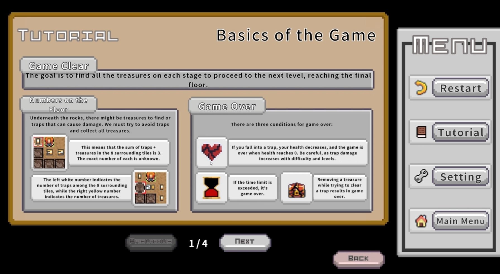
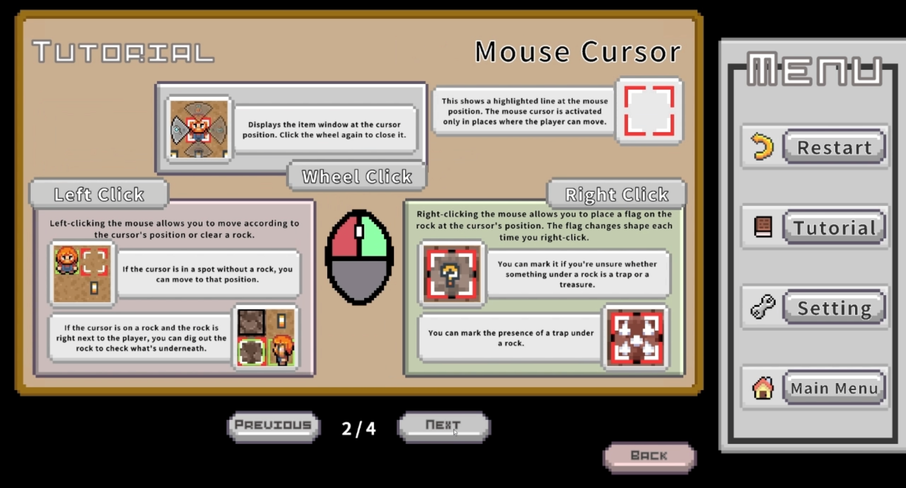
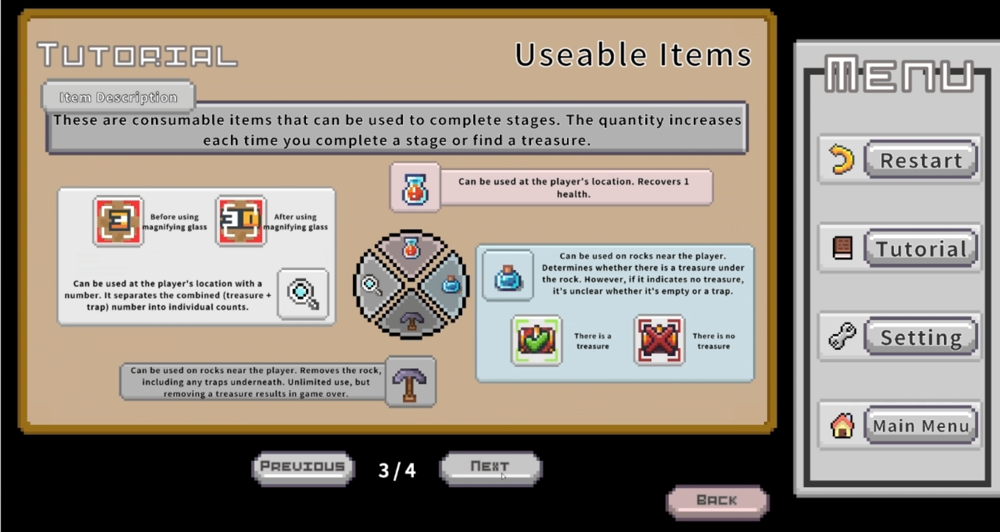
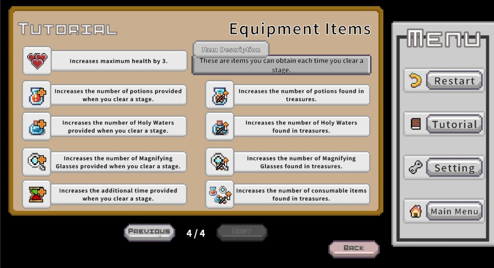

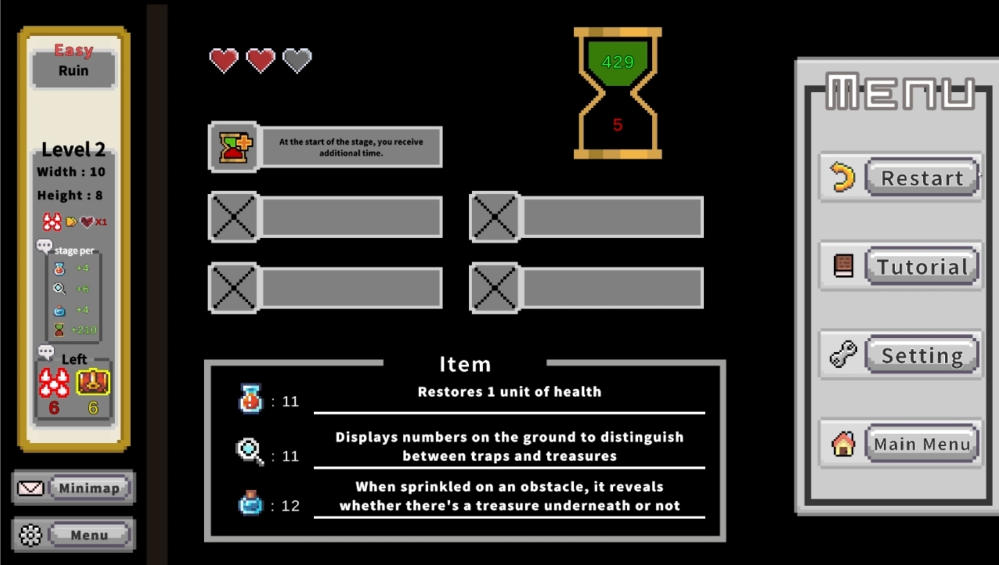

# GameImages
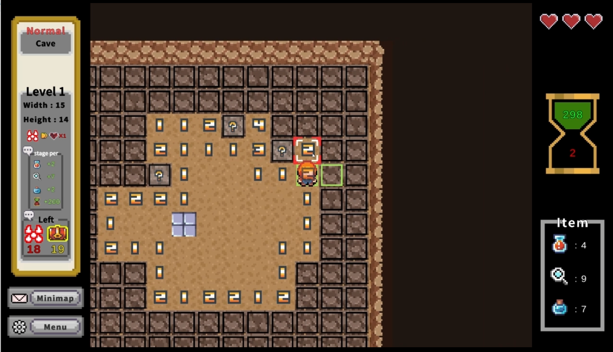
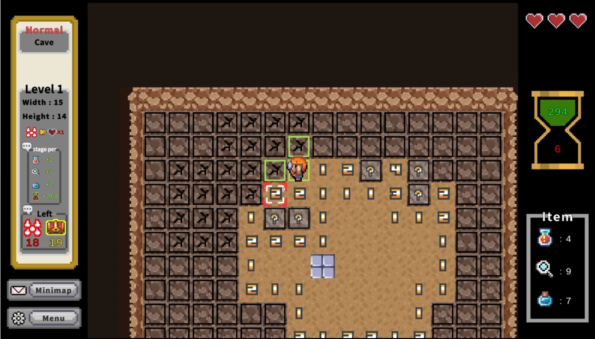
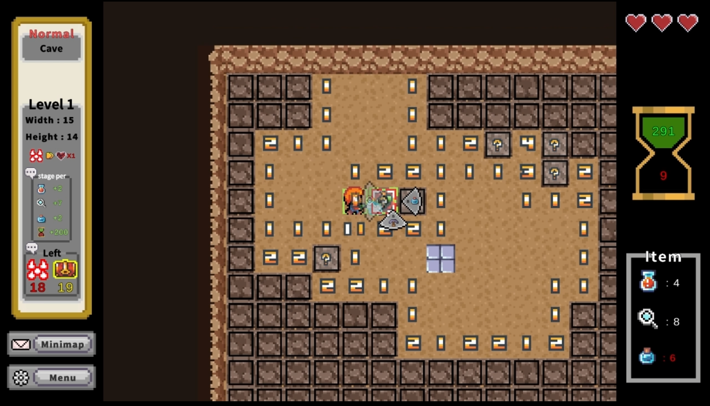
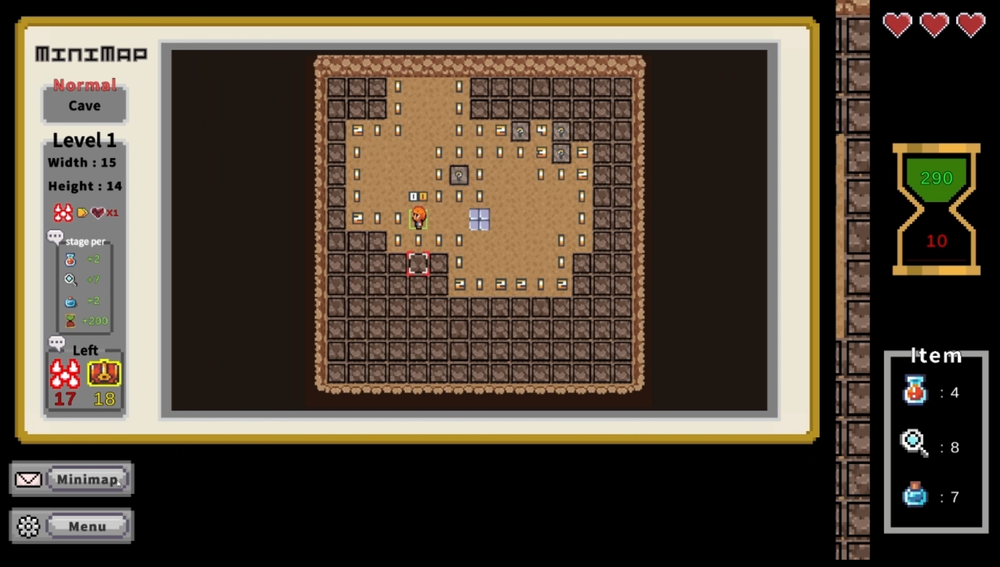
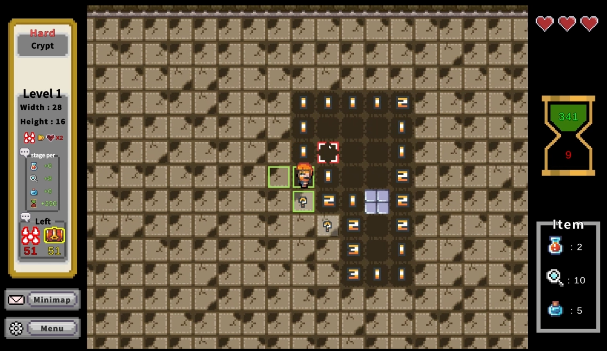
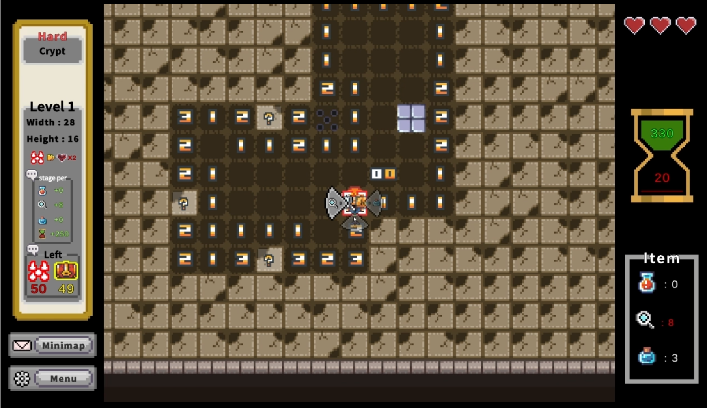
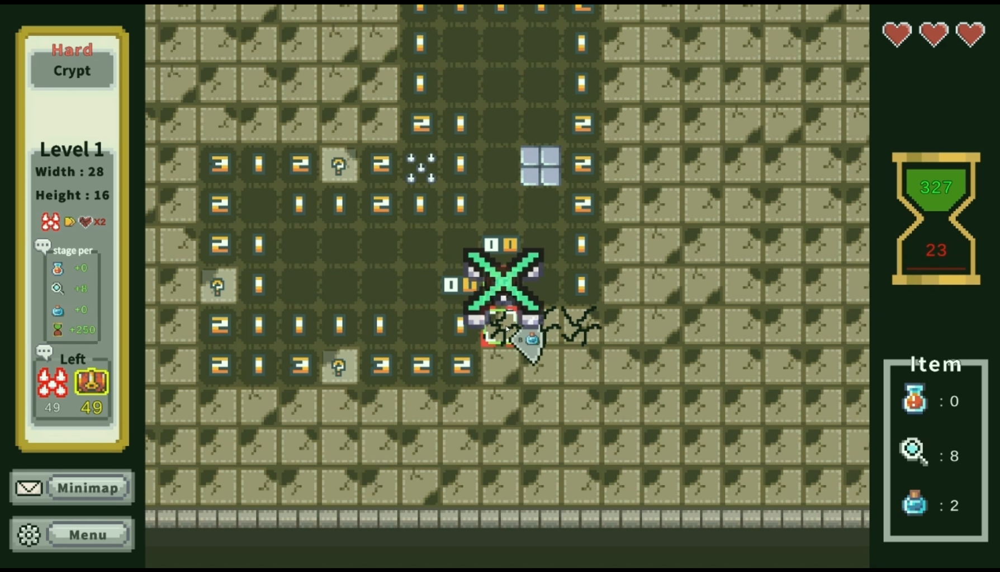
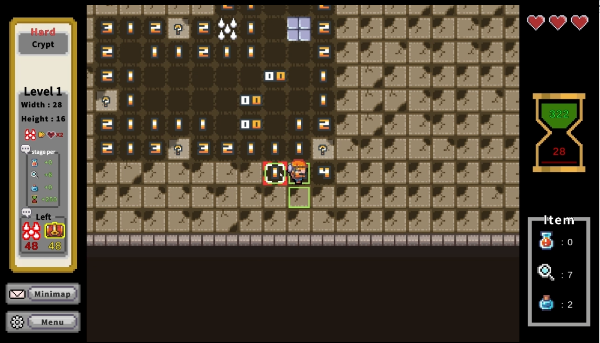
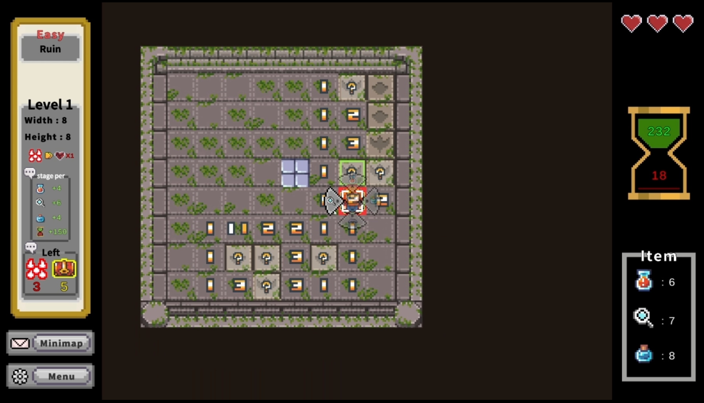
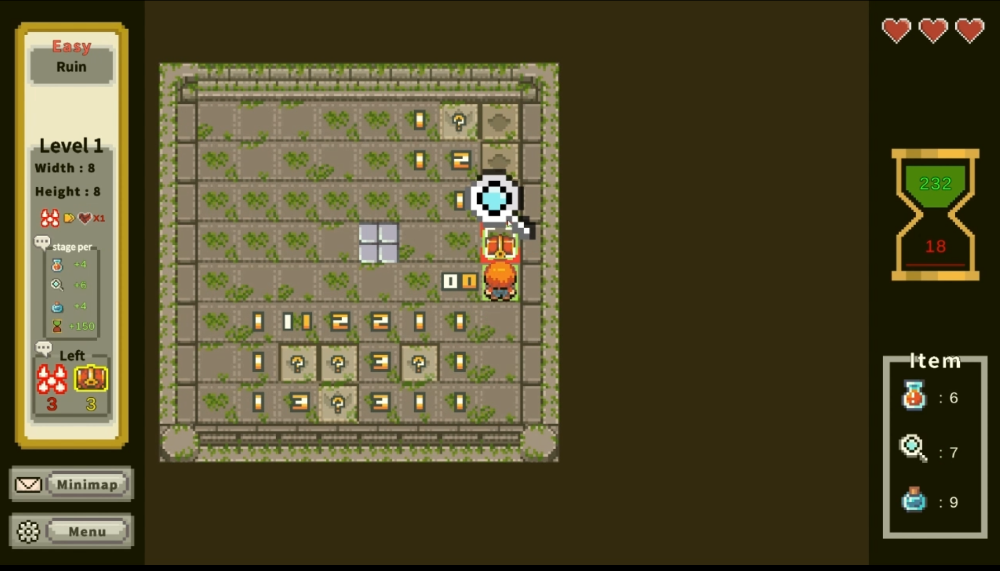
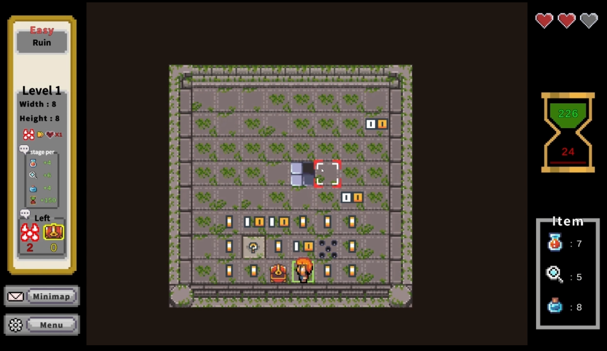
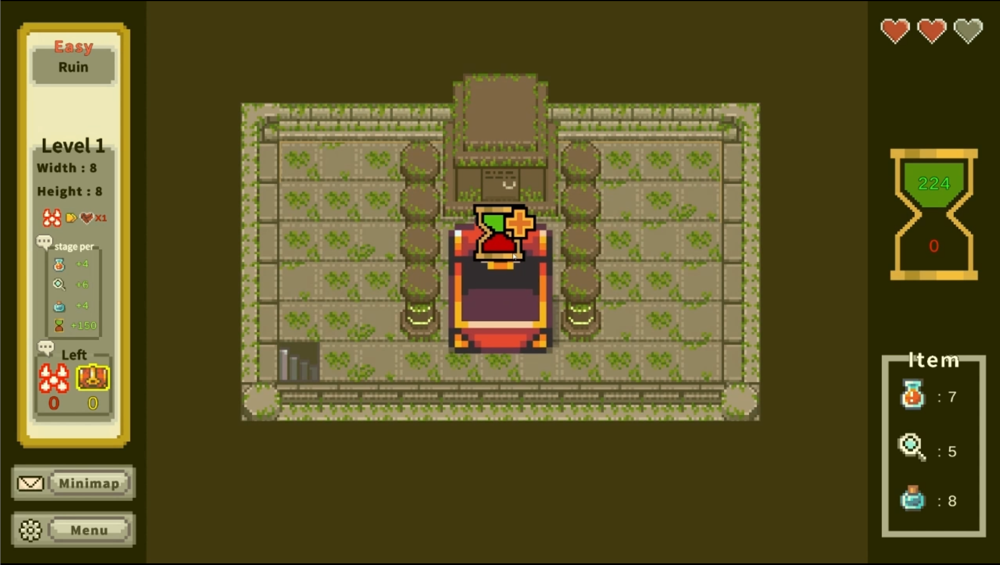

